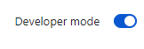
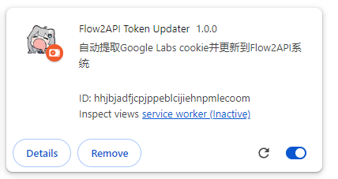
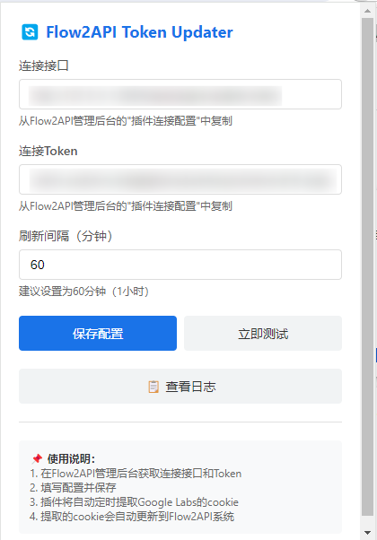
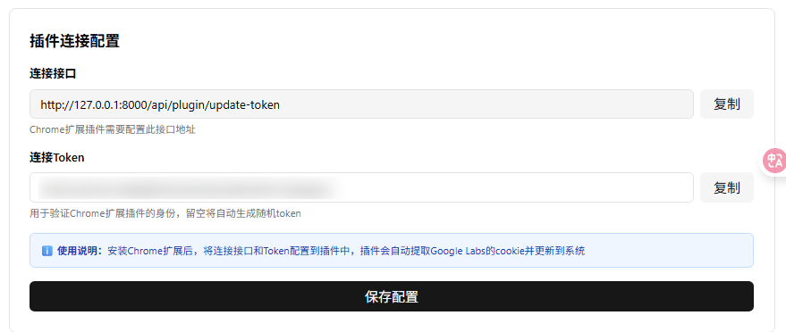

# Instructions

Requires the [Flow2api](https://github.com/TheSmallHanCat/flow2api) service.

## 1. Installation

1.  **Open the Extensions page**
    Navigate to in Chrome:
    `chrome://extensions/`

2.  **Enable Developer Mode**
    Toggle **"Developer mode"** in the top-right corner.
    

3.  **Load the extension**
    Drag the unpacked extension folder into the browser page, or click "Load unpacked" and select the folder.
    

## 2. Configuration

1.  **Set API URL and Token**
    Click the extension icon and configure the **API URL** and **Connection Token** in the popup. Default interval is 60 minutes; ~6 hours is generally recommended.
    

2.  **Finding your credentials**
    If unsure what to enter, log in to the **Flow2api admin panel** to find the API endpoint and access token.
    
